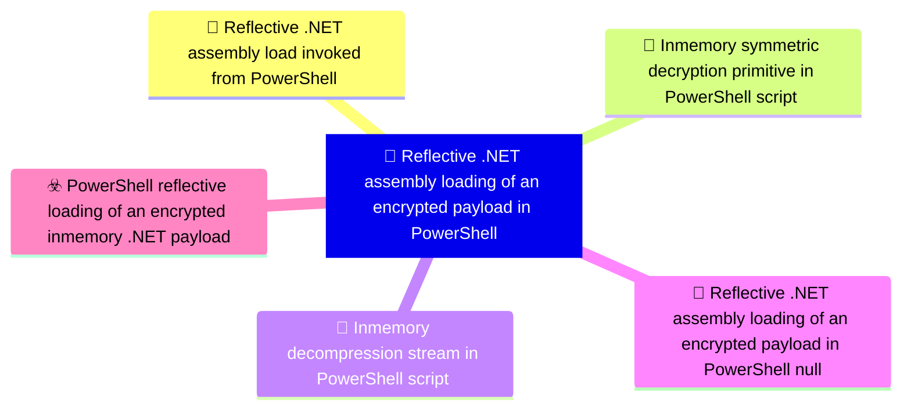

# 🎯 Reflective .NET assembly loading of an encrypted payload in PowerShell

**🚩 Priority : `High`**

🚦 **TLP:CLEAR** ⚪ : Recipients can spread this to the world, there is no limit on disclosure.

🗡️ **ATT&CK Techniques** :  [T1620 : Reflective Code Loading](https://attack.mitre.org/techniques/T1620 'Adversaries may reflectively load code into a process in order to conceal the execution of malicious payloads Reflective loading involves allocating t'), [T1027.013 : Obfuscated Files or Information: Encrypted/Encoded File](https://attack.mitre.org/techniques/T1027/013 'Adversaries may encrypt or encode files to obfuscate strings, bytes, and other specific patterns to impede detection Encrypting andor encoding file co'), [T1059.001 : Command and Scripting Interpreter: PowerShell](https://attack.mitre.org/techniques/T1059/001 'Adversaries may abuse PowerShell commands and scripts for execution PowerShell is a powerful interactive command-line interface and scripting environm')

---

`🔑 UUID : 7b6363fc-390c-4fd6-b456-d69781f0ae31` **|** `🏷️ Version : 1` **|** `🗓️ Creation Date : 2026-07-21` **|** `🗓️ Last Modification : 2026-07-21` **|** `👩‍💻 Model author : Nicola&Claude` **|** `👥 Contributors : None` **|** `Sharing Organisation : None` **|** `🧱 Schema Identifier : dom::1.0`

## 💡 Objective

**🏷️ Type** : Threat - Alerts meant for detection cybersecurity threats, and which should eventually trigger Incident Response  

> ## Goal
> Identify PowerShell executing the decrypt-decompress-load chain that maps a .NET assembly
> into memory without writing it to disk in executable form. The objective targets the
> *loader*, not the payload: what is being detected is the mechanism by which arbitrary code
> is introduced into a running process, regardless of what that code subsequently does.
> 
> ## Why the chain, and not the load alone
> Reflective assembly loading is not inherently malicious — installers, module loaders, and
> management agents use it legitimately, so a signal on `Assembly.Load` alone is unusable as
> an alert. What distinguishes the adversarial case is that the loaded bytes arrive
> *encrypted and compressed*, which serves no purpose for a legitimate in-process load where
> the assembly is already available as a file or resource. The detection value therefore lives
> in the co-occurrence of the stages, not in any stage individually. Each signal below is
> deliberately weak on its own and is not intended for independent deployment.
> 
> ## Scope and known limitations
> This objective covers the **unobfuscated** expression of the chain, where .NET API names
> appear as literal strings in recorded script text. It does not cover string concatenation,
> aliasing, runtime type resolution, or the case where the entire loader is itself delivered as
> an encoded blob and executed through `Invoke-Expression` — all of which defeat literal
> matching. Recall against a motivated adversary is low by construction; the objective is
> calibrated to catch commodity and unmodified-tooling use. Closing the obfuscation gap
> requires an independent vantage point such as AMSI buffer inspection, which is a candidate
> for a future objective rather than a signal here.
> 

**🎼 Composition** : Entity - When the same entity is appearing across alerts raised by signals, they should be grouped around the entity into a single incident, case, or higher-order alert (alert of alert)

> Signals must be correlated around the **process entity** — the PowerShell process
identified by its device and initiating process identifiers — and not evaluated in
isolation.

The alerting threshold is **at least two of the three signals** attributable to the same
process. Two-of-three rather than three-of-three is deliberate: PowerShell script block
logging fragments long scripts across multiple events, so a genuine loader may only ever
surface two of its three stages in the retained record, and a strict three-of-three gate
would silently miss it. Three-of-three should be treated as high-confidence and is a
reasonable severity escalation, not a precondition for alerting.

Correlation must be bounded to a single process instance rather than a time bucket alone.
Process identifiers are recycled by Windows, so any implementation joining across events
must qualify the process identifier with its creation time, or use a stable unique process
identifier where the platform provides one.

### 🌊 Related OpenTide Objects

**Threats**

| ☣️ Threat Vectors                                                                                                                                                                                                                                                                                                                                 |
|:--------------------------------------------------------------------------------------------------------------------------------------------------------------------------------------------------------------------------------------------------------------------------------------------------------------------------------------------------|
| [PowerShell reflective loading of an encrypted in-memory .NET payload](../Threat%20Vectors/☣️%20PowerShell%20reflective%20loading%20of%20an%20encrypted%20in-memory%20.NET%20payload '## Attack FlowThe adversary embeds or stages a NET assembly that has been compressed with GZip and thenencrypted with a symmetric AES key A PowerShell...') |

**Rules**

| 📡 Detection Objective Signals (3)                                                                                                                                                                                                                                                           | 🚨 Detection Rules                                                                                                                                                                                                                                                                                                                                       |
|:--------------------------------------------------------------------------------------------------------------------------------------------------------------------------------------------------------------------------------------------------------------------------------------------|:--------------------------------------------------------------------------------------------------------------------------------------------------------------------------------------------------------------------------------------------------------------------------------------------------------------------------------------------------------|
| [In-memory decompression stream in PowerShell script](#in-memory-decompression-stream-in-powershell-script 'PowerShell script text constructing a NET decompression stream over an in-memory buffer GZipStream or DeflateStreamDeflateStream is included alongside...')                     | ❌ No Detection Rules                                                                                                                                                                                                                                                                                                                                    |
| [In-memory symmetric decryption primitive in PowerShell script](#in-memory-symmetric-decryption-primitive-in-powershell-script 'PowerShell script text instantiating a NET symmetric cryptography provider or invokinga decryptor  AesCryptoServiceProvider, RijndaelManaged, CreateDe...') | ❌ No Detection Rules                                                                                                                                                                                                                                                                                                                                    |
| [Reflective .NET assembly load invoked from PowerShell](#reflective-.net-assembly-load-invoked-from-powershell 'PowerShell script text referencing the NET reflection API surface used to map anassembly from a byte array into the current process  principallySystem...')                 | ❌ No Detection Rules                                                                                                                                                                                                                                                                                                                                    |
| 🔗 Maps against the Detection Objective                                                                                                                                                                                                                                                      | [Reflective .NET assembly loading of an encrypted payload in PowerShell](../Detection%20Rules/🚨%20Reflective%20.NET%20assembly%20loading%20of%20an%20encrypted%20payload%20in%20PowerShell 'DEFENDER_FOR_ENDPOINT   DESIGN&#013;&#010;&#013;&#010;Detects PowerShell script blocks that combine in-memory decryption, decompression, andreflective...') |

## 📡 Signals

### Reflective .NET assembly load invoked from PowerShell

🪪 **UUID** : `5a4aab19-a2aa-497b-babc-27bcc008f67d`

> PowerShell script text referencing the .NET reflection API surface used to map an
assembly from a byte array into the current process — principally
`[System.Reflection.Assembly]::Load()`, and equivalently the `Reflection.Assembly` type
expression or a `GetType("System.Reflection.Assembly")` resolution.

Matching must be case-insensitive. PowerShell is a case-insensitive language, so
`[reflection.assembly]::load` is as valid as the canonical casing and appears in real
scripts. Matching must also account for the API name being a substring within a dotted
type expression rather than a standalone token, which rules out purely token-indexed
matching for the precise check — though a token-level pre-filter on `Reflection` is an
effective and cheap first pass.

On its own this signal is high-volume and benign in most environments. It carries
detection value only in combination.

**🔎 Data Visibility**

- **Availability** : Unknown
- **Requirements** : `Requires PowerShell script block content (Windows event 4104 equivalent) to be
recorded and retained, with the script text queryable as a field.

Availability is marked Unknown pending tenant verification on Microsoft Defender for
Endpoint. Script block text is not a first-class Defender column; it is expected under
`DeviceEvents` where `ActionType == "PowerShellCommand"`, nested inside the
`AdditionalFields` JSON. Three things must be confirmed before any rule built on this
signal can be considered validated: that the action type returns rows at all, which
key inside `AdditionalFields` carries the script text, and whether that text is
complete or truncated. Truncation would materially weaken this signal and the
objective's correlation strategy alike.
`

_💾 Possible logsources_

_❌ No logsources mentioned_

**🧲 Related Entities**

| Name     | Category                                  | Description                                                                                       |
|:---------|:------------------------------------------|:--------------------------------------------------------------------------------------------------|
| Process  | **Host Entities** : Host Related Entities | Represents a running process on a host, including its attributes likeprocess ID and command line. |
| Account  | **Host Entities** : Host Related Entities | Represents a user account entity, including local, domain, or cloud-basedaccounts.                |
| Hostname | **Host Entities** : Host Related Entities | Represents the name of a host or device in the network.                                           |

**⚠️ Detectors**

_❌ No detectors mentioned_

**🌐 Examples**

_❌ No examples mentioned_

### In-memory symmetric decryption primitive in PowerShell script

🪪 **UUID** : `deb3dda8-fd4c-4a82-a980-46e49bafff93`

> PowerShell script text instantiating a .NET symmetric cryptography provider or invoking
a decryptor — `AesCryptoServiceProvider`, `RijndaelManaged`, `CreateDecryptor`, or a
direct reference to the `System.Security.Cryptography` namespace.

The API names must be anchored to real cryptographic types. A naive substring match on
`AES` is unusable and must be avoided: it is three characters, matches inside unrelated
words, and corresponds to no specific API. This was a defect in the source artefact ref
[a] and is the single largest source of noise in that rule.

In-process decryption is unusual in benign administrative scripting, which makes this
signal more discriminating than the reflection signal — but it is still not
alert-worthy alone, since credential-handling and configuration-protection scripts
legitimately decrypt in memory.

**🔎 Data Visibility**

- **Availability** : Unknown
- **Requirements** : `Same source and same verification dependency as the reflective load signal — PowerShell
script block content with queryable script text. No additional telemetry required.
`

_💾 Possible logsources_

_❌ No logsources mentioned_

**🧲 Related Entities**

| Name     | Category                                  | Description                                                                                       |
|:---------|:------------------------------------------|:--------------------------------------------------------------------------------------------------|
| Process  | **Host Entities** : Host Related Entities | Represents a running process on a host, including its attributes likeprocess ID and command line. |
| Account  | **Host Entities** : Host Related Entities | Represents a user account entity, including local, domain, or cloud-basedaccounts.                |
| Hostname | **Host Entities** : Host Related Entities | Represents the name of a host or device in the network.                                           |

**⚠️ Detectors**

_❌ No detectors mentioned_

**🌐 Examples**

_❌ No examples mentioned_

### In-memory decompression stream in PowerShell script

🪪 **UUID** : `c57f232a-2a9d-4250-8c3b-b68b13db2cae`

> PowerShell script text constructing a .NET decompression stream over an in-memory buffer
— `GZipStream` or `DeflateStream`.

`DeflateStream` is included alongside `GZipStream` because the two are near-equivalent
for this purpose and trivially interchangeable in a loader; matching only the former
leaves an evasion gap that costs nothing to close.

This is the weakest of the three signals in isolation. Compression handling appears in
entirely routine scripting — log processing, archive manipulation, and web content
handling all produce it. It is included because its presence alongside decryption and
reflective loading is what evidences a staged payload rather than incidental data
handling.

**🔎 Data Visibility**

- **Availability** : Unknown
- **Requirements** : `Same source and same verification dependency as the other two signals — PowerShell
script block content with queryable script text. No additional telemetry required.
`

_💾 Possible logsources_

_❌ No logsources mentioned_

**🧲 Related Entities**

| Name     | Category                                  | Description                                                                                       |
|:---------|:------------------------------------------|:--------------------------------------------------------------------------------------------------|
| Process  | **Host Entities** : Host Related Entities | Represents a running process on a host, including its attributes likeprocess ID and command line. |
| Account  | **Host Entities** : Host Related Entities | Represents a user account entity, including local, domain, or cloud-basedaccounts.                |
| Hostname | **Host Entities** : Host Related Entities | Represents the name of a host or device in the network.                                           |

**⚠️ Detectors**

_❌ No detectors mentioned_

**🌐 Examples**

_❌ No examples mentioned_

## References

**🕊️ Publicly available resources**

- [_1_] https://attack.mitre.org/techniques/T1620/
- [_2_] https://attack.mitre.org/techniques/T1027/013/

**🏦 Private references**

- [_a_] DetectionsAI rule 45c170c3-7340-4b0c-8a97-2f3be327f857

[1]: https://attack.mitre.org/techniques/T1620/
[2]: https://attack.mitre.org/techniques/T1027/013/
[a]: DetectionsAI rule 45c170c3-7340-4b0c-8a97-2f3be327f857

