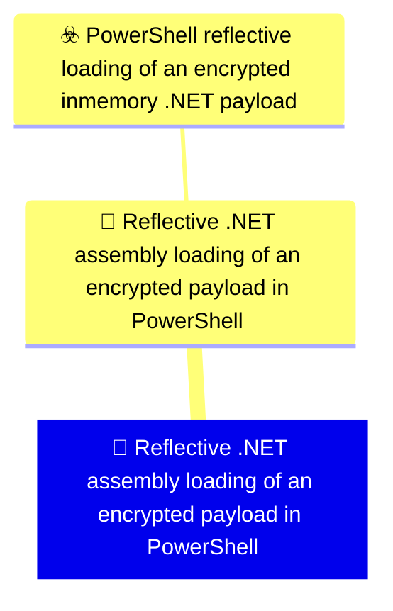

# 🚨 Reflective .NET assembly loading of an encrypted payload in PowerShell

🚦 **TLP:CLEAR** ⚪ : Recipients can spread this to the world, there is no limit on disclosure.

🗡️ **ATT&CK Techniques** :  [T1620 : Reflective Code Loading](https://attack.mitre.org/techniques/T1620 'Adversaries may reflectively load code into a process in order to conceal the execution of malicious payloads Reflective loading involves allocating t'), [T1027.013 : Obfuscated Files or Information: Encrypted/Encoded File](https://attack.mitre.org/techniques/T1027/013 'Adversaries may encrypt or encode files to obfuscate strings, bytes, and other specific patterns to impede detection Encrypting andor encoding file co'), [T1059.001 : Command and Scripting Interpreter: PowerShell](https://attack.mitre.org/techniques/T1059/001 'Adversaries may abuse PowerShell commands and scripts for execution PowerShell is a powerful interactive command-line interface and scripting environm')

---

`🔑 UUID : 2e5424dd-4163-4fd6-9776-7c74dcfad857` **|** `🏷️ Version : 1` **|** `🗓️ Creation Date : 2026-07-21` **|** `🗓️ Last Modification : 2026-07-21` **|** `👩‍💻 Model author : Nicola&Claude` **|** `🧱 Schema Identifier : mdr::2.1`

## 👁️‍🗨️ Description

> Detects PowerShell script blocks that combine in-memory decryption, decompression, and
> reflective .NET assembly loading — the loader pattern used to execute a payload without
> writing it to disk in executable form.
> 
> At least two of the three stages must be observed within the same PowerShell process. The
> two-of-three threshold is inherited from DOM0001 and is deliberate: script block logging
> fragments long scripts across multiple events, so a strict three-of-three gate would silently
> miss genuine loaders whose third stage never reached the retained record.
> 
> ## Rewrite provenance
> This rule replaces a source artefact (ref [a]) that could not run. That artefact referenced a
> non-existent table (`PowerShellPowerShell(EventID=4104)`, an unconverted Sigma logsource
> stub), projected Sentinel columns (`TimeGenerated`, `Computer`, `UserName`) that do not exist
> in Defender, carried no correlation across fragmented script blocks, and gated on
> `contains "AES"` — a three-character case-insensitive substring that matches inside unrelated
> tokens and corresponds to no API. Every one of those defects is addressed here.
> 
> ## Known limitations
> Covers the unobfuscated expression of the chain only. String concatenation
> (`"Assembly"+".Load"`), backtick insertion, variable indirection, or delivering the loader
> itself as an encoded blob for `Invoke-Expression` all defeat literal matching. Recall against
> a motivated adversary is low by construction. This is calibrated for commodity and
> unmodified-tooling use, and should not be presented to stakeholders as coverage of the
> technique class as a whole.
> 

### 🕸️ Relations





| 🎯 Detection Objectives                                                                                                                                                                                                                                                                                                                                          | ☣️ Threat Vectors                                                                                                                                                                                                                                                                                                                                    | 🛡️ Detection Models    | 📡 Detection Objective Signals    |
|:----------------------------------------------------------------------------------------------------------------------------------------------------------------------------------------------------------------------------------------------------------------------------------------------------------------------------------------------------------------|:-----------------------------------------------------------------------------------------------------------------------------------------------------------------------------------------------------------------------------------------------------------------------------------------------------------------------------------------------------|:-----------------------|:---------------------------------|
| [Reflective .NET assembly loading of an encrypted payload in PowerShell](../Detection%20Objectives/🎯%20Reflective%20.NET%20assembly%20loading%20of%20an%20encrypted%20payload%20in%20PowerShell.md '## GoalIdentify PowerShell executing the decrypt-decompress-load chain that maps a NET assemblyinto memory without writing it to disk in executable fo...') | [PowerShell reflective loading of an encrypted in-memory .NET payload](../Threat%20Vectors/☣️%20PowerShell%20reflective%20loading%20of%20an%20encrypted%20in-memory%20.NET%20payload.md '## Attack FlowThe adversary embeds or stages a NET assembly that has been compressed with GZip and thenencrypted with a symmetric AES key A PowerShell...') | ❌ No Detection Models  | ❌ No Detection Objective Signals |

&nbsp;

## ⚠️ Response

| 🌡️ Alert Severity                                                                     | ‍🚒 Alert Handling Team                                     | 👣 Playbook link                                 |
|:--------------------------------------------------------------------------------------|:-----------------------------------------------------------|:------------------------------------------------|
| **High** : Needs attention within tight SLAs alongside a comprehensive investigation. | **No defined responders for alerts generated by this MDR** | No playbook was defined for this detection rule |

### 📋 Procedure

#### 🕵🏼‍♂️ Analysis

> ## Triage sequence
> 1. **Read `ScriptBlockSample` first.** The sampled script text is the fastest path to a
>    verdict. A genuine loader reads as a contiguous decrypt → decompress → load sequence
>    operating on a byte array. Incidental matches read as unrelated operations that merely
>    happen to co-occur in a long administrative script.
> 2. **Check `StagesObserved`.** A value of 3 is materially stronger than 2. At 2, identify
>    which stage is absent — a missing reflective load with decryption and decompression
>    present is frequently benign data handling, whereas a missing decompression stage
>    alongside decryption and reflective loading is more suspicious.
> 3. **Check `InitiatingProcessFileName`.** A PowerShell process spawned by a software
>    deployment or configuration management agent is the most common benign source. A
>    PowerShell process spawned by Office, a browser, a script host, or with no plausible
>    parent warrants escalation.
> 4. **Pivot to process ancestry and subsequent network activity** using the supporting
>    searches below. A loader that is a true positive is rarely the first or last event in
>    the chain.
> 
> ## Expected false positives, with disposition
> - **Software deployment and configuration management agents.** These legitimately load
>   signed helper assemblies reflectively and may decrypt configuration in memory. Confirm
>   the parent process is the management agent *and* the account is SYSTEM *and* the script
>   text references vendor namespaces. If all three hold, add the parent to the environment
>   filter block in the query. Do not blanket-exclude SYSTEM — a loader running as SYSTEM is
>   precisely the high-severity case.
> - **Credential and secret handling scripts.** These trip the decryption stage alone. They
>   should not reach two-of-three unless combined with unrelated compression handling; if
>   they do, the sample text will make it obvious.
> - **Log and archive processing scripts.** These trip decompression alone, and reach
>   two-of-three only in combination with something else. Verify against the sample.
> 
> ## Verification status
> This rule has never been executed against production data. The tenant has confirmed that
> `DeviceEvents` carries `ActionType == "PowerShellCommand"` with complete, untruncated
> script text under `AdditionalFields.Command`, and that no `ScriptBlockId` key is available
> — hence the process-level correlation rather than script-block-level. Column presence for
> `AccountName` and `InitiatingProcessCreationTime` on this action type has **not** been
> independently verified against a tenant table reference, and should be confirmed before
> the rule is promoted beyond DESIGN.
> 

#### 🔎 Supporting Searches

<table>
<tr><th>Purpose</th>
<th>Target System</th>
<th>Query</th>
</tr><tr>

<td>Reconstruct the process ancestry of the flagged PowerShell process to establish how it
was launched. Substitute the DeviceId and process identifiers from the alert.

</td>
<td>defender_for_endpoint</td>

<td>

```sql
let target_device = "<DeviceId from alert>";
let alert_time = datetime(<Timestamp from alert>);
DeviceProcessEvents
| where Timestamp between ((alert_time - 1h) .. (alert_time + 15m))
| where DeviceId == target_device
| project Timestamp, DeviceName, AccountName, FileName, ProcessCommandLine,
    InitiatingProcessFileName, InitiatingProcessCommandLine, ProcessId, InitiatingProcessId
| order by Timestamp asc
```
</td>
</tr>
<tr>

<td>Identify outbound network activity initiated by the flagged PowerShell process shortly
after the loader executed. A reflectively loaded payload that establishes C2 will
surface here.

</td>
<td>defender_for_endpoint</td>

<td>

```sql
let target_device = "<DeviceId from alert>";
let alert_time = datetime(<Timestamp from alert>);
DeviceNetworkEvents
| where Timestamp between (alert_time .. (alert_time + 30m))
| where DeviceId == target_device
| where InitiatingProcessFileName in~ ("powershell.exe", "pwsh.exe")
| where ActionType == "ConnectionSuccess"
| project Timestamp, DeviceName, InitiatingProcessFileName, InitiatingProcessId,
    RemoteIP, RemoteUrl, RemotePort, RemoteIPType
| order by Timestamp asc
```
</td>
</tr>
<tr>

<td>Establish prevalence of the same loader pattern across the estate. A pattern appearing
on a single device suggests targeted activity; one appearing broadly and consistently
suggests a legitimate tool warranting an environment filter rather than an incident.

</td>
<td>defender_for_endpoint</td>

<td>

```sql
DeviceEvents
| where Timestamp > ago(30d)
| where ActionType == "PowerShellCommand"
| extend ScriptBlock = tostring(parse_json(AdditionalFields).Command)
| where ScriptBlock has_any ("Reflection", "GZipStream", "DeflateStream", "CreateDecryptor", "AesCryptoServiceProvider", "RijndaelManaged")
| summarize Devices = dcount(DeviceId), Events = count(), FirstSeen = min(Timestamp), LastSeen = max(Timestamp)
    by InitiatingProcessFileName
| order by Devices desc
```
</td>
</tr>

</table>

#### 🔐 Containment
> Confirmed true positive means arbitrary attacker-controlled code has already executed in
> memory on the host. Treat the host as compromised and the loaded payload as unknown.
> 
> 1. Isolate the device. The payload never touched disk in executable form, so file-based
>    containment alone is insufficient and antivirus scanning will not necessarily find it.
> 2. Preserve volatile evidence before reboot where the response process allows — the
>    assembly exists only in the memory of the PowerShell process, and a reboot destroys the
>    primary artefact.
> 3. Treat all credentials used on or accessible from the host as compromised, and rotate
>    them. In-memory execution is commonly a precursor to credential access.
> 4. Recover the staged payload and key from the script text captured in the alert where
>    possible, and decrypt offline to establish what was actually loaded. This determines
>    the true scope of the incident; without it, impact assessment is guesswork.
> 5. Hunt for the same loader pattern across the estate using the prevalence search above
>    before closing.
> 

&nbsp;

## 💽 Configurations


<details>
<summary>Microsoft Defender for Endpoint <b>DESIGN</b></summary>

>**Status** : `DESIGN` - _Under active functional design, without technical translation yet_
>**Strategy** : `INERT` - _Does not interact with deployment_

| Parameter                     | System Config                                   | Description                                                                                                                                                                                                                                                                                                                                                                                                                                                                                                                                                                                                                                                                                         | Config                                                                                                                                                                                                                                                                                                                                                                     |
|:------------------------------|:------------------------------------------------|:----------------------------------------------------------------------------------------------------------------------------------------------------------------------------------------------------------------------------------------------------------------------------------------------------------------------------------------------------------------------------------------------------------------------------------------------------------------------------------------------------------------------------------------------------------------------------------------------------------------------------------------------------------------------------------------------------|:---------------------------------------------------------------------------------------------------------------------------------------------------------------------------------------------------------------------------------------------------------------------------------------------------------------------------------------------------------------------------|
| Schema identifier and version |                                                 | Identifier of the schema at its current version                                                                                                                                                                                                                                                                                                                                                                                                                                                                                                                                                                                                                                                     | `defender_for_endpoint::2.1`                                                                                                                                                                                                                                                                                                                                               |
| ⏲ Rule Schedule               | `schedule`                                      | Select the frequency by which the query will run and trigger alerts. If you set it to run less frequently, it will have a longer lookback duration.  Queries that run every 24 hours check the past 30 days. Queries that run every 12 hours check the past 48 hours. Queries that run every 3 hours check the past 12 hours. Queries that run every hour check the past 4 hours. Queries that run continuously check events as they are ingested into Microsoft Defender XDR.  NRT is supported for specific tables and columns. Please see the documentation for more details. https://learn.microsoft.com/en-us/defender-xdr/custom-detection-rules?view=o365-worldwide#continuous-nrt-frequency | `1H`                                                                                                                                                                                                                                                                                                                                                                       |
| Device                        |                                                 | Represents a device that was identified in an alert triggered by a custom detection rule. Make sure that the column exists in the results of the query search.                                                                                                                                                                                                                                                                                                                                                                                                                                                                                                                                      | `DeviceId`                                                                                                                                                                                                                                                                                                                                                                 |
| User                          |                                                 | Represents a user that was identified in an alert triggered by a custom detection rule. Make sure that the column exists in the results of the query search.                                                                                                                                                                                                                                                                                                                                                                                                                                                                                                                                        | `AccountName`                                                                                                                                                                                                                                                                                                                                                              |
| 🎫 Alert Title                 | `detectionAction.alertTemplate.title`           | Name of the alert triggered by the custom detection rule. By default, the name of the MDR will be used, but this parameter allows to override it.                                                                                                                                                                                                                                                                                                                                                                                                                                                                                                                                                   | `Reflective .NET assembly loading of an encrypted payload in PowerShell`                                                                                                                                                                                                                                                                                                   |
| 🔬 Alert Description           | `detectionAction.alertTemplate.description`     | Detailed description of the alert triggered by the custom detection rule. This text provides context about the detection and helps analysts understand the nature of the threat.  By default, the description of the MDR will be used, but this parameter allows to override it.                                                                                                                                                                                                                                                                                                                                                                                                                    | `PowerShell on {{DeviceName}} executed a script block combining in-memory decryption, decompression, and reflective .NET assembly loading. This is the loader pattern used to execute a payload without writing it to disk in executable form. `                                                                                                                           |
| Threat Category               | `detectionAction.alertTemplate.category`        | Threat Category assigned to the alert triggered by the detection rule.                                                                                                                                                                                                                                                                                                                                                                                                                                                                                                                                                                                                                              | `Defense Evasion`                                                                                                                                                                                                                                                                                                                                                          |
| ATT&CK Techniques             |                                                 | Relevant techniques to map this rule onto. The available techniques are category-dependent, at the moment we do not provide a structured support to validate those techniques. You may refer to the GUI - create a mock detection rule, input the desired category, and see which techniques are presented. You may then input the relevant Technique IDs.                                                                                                                                                                                                                                                                                                                                          | `T1620`, `T1027.013`, `T1059.001`                                                                                                                                                                                                                                                                                                                                          |
| 💣 Alert Severity              | `detectionAction.alertTemplate.severity`        | Severity of the generated alert. By default, the alert_severity of the MDR is mapped to the severity, this parameter allows to override this behaviour.                                                                                                                                                                                                                                                                                                                                                                                                                                                                                                                                             | `High`                                                                                                                                                                                                                                                                                                                                                                     |
| Alert Response Recommendation | `detectionAction.alertTemplate.recommendation`  | Recommended actions to respond to the threat related to the alert triggered by the custom detection rule.                                                                                                                                                                                                                                                                                                                                                                                                                                                                                                                                                                                           | `Review the captured script text in the alert to confirm a contiguous decrypt-decompress-load sequence rather than incidental co-occurrence, then establish process ancestry and any subsequent outbound connections. If confirmed, isolate the device and treat host credentials as compromised — the payload executed in memory and will not be recoverable from disk. ` |
| Device Group Selection        | `detectionAction.organizationalScope.scopeType` | Select to which device group this response action will be applied to. If set to All - will apply to all endpoints, if set to Specific will require to select the relevant device groups                                                                                                                                                                                                                                                                                                                                                                                                                                                                                                             | `All`                                                                                                                                                                                                                                                                                                                                                                      |

</details>
&nbsp; 


### 🔎 Queries


<details>
<summary>Expand to view Microsoft Defender for Endpoint <b>DESIGN</b> query</summary>

```sql
// ============================================================
// Detection: Reflective .NET assembly loading of an encrypted payload in PowerShell
// Objective: DOM0001 (7b6363fc-390c-4fd6-b456-d69781f0ae31)
// Vector: TVM0001 (72e77176-58de-4bd2-b5a2-d05db16b474f)
// MITRE: T1620 - Reflective Code Loading; T1027.013 - Encrypted/Encoded File;
//        T1059.001 - Command and Scripting Interpreter: PowerShell
// Platform: DEFENDER
// Precision: MEDIUM | Recall risk: HIGH - literal API names, defeated by concatenation
// STATUS: Never executed against production data. Status DESIGN (INERT, no deployment).
// ============================================================
//
// No explicit Timestamp filter: the Defender detection engine manages lookback for
// scheduled custom detection rules. A 1H schedule checks the past 4 hours.
DeviceEvents
// ActionType first. AdditionalFields parsing is expensive and must never run table-wide.
| where ActionType == "PowerShellCommand"
| extend ScriptBlock = tostring(parse_json(AdditionalFields).Command)
| where isnotempty(ScriptBlock)
// Indexed term pre-filter: a cheap term-level gate before any contains-family scan.
// Every term here is >3 chars, so all are held in the term index.
| where ScriptBlock has_any ("Reflection", "GZipStream", "DeflateStream",
                             "CreateDecryptor", "AesCryptoServiceProvider", "RijndaelManaged")
// Stage flags use contains rather than has: these are substrings inside dotted type
// expressions such as [System.Reflection.Assembly]::Load, which term indexing splits apart.
// Case-insensitive is deliberate - PowerShell is a case-insensitive language, so
// [reflection.assembly]::load is equally valid and appears in real scripts.
| extend IsReflectiveLoad = ScriptBlock contains "Reflection.Assembly"
                         or ScriptBlock contains "Assembly]::Load"
| extend IsDecrypt = ScriptBlock contains "AesCryptoServiceProvider"
                  or ScriptBlock contains "RijndaelManaged"
                  or ScriptBlock contains "CreateDecryptor"
| extend IsDecompress = ScriptBlock contains "GZipStream"
                     or ScriptBlock contains "DeflateStream"
| where IsReflectiveLoad or IsDecrypt or IsDecompress
// Correlate stages across events belonging to the same PowerShell process. Script block
// logging fragments long scripts, so the stages routinely arrive in separate events.
// InitiatingProcessId is qualified with InitiatingProcessCreationTime because Windows
// recycles process identifiers - without it, an unrelated older process can absorb events.
| summarize
    (Timestamp, ReportId) = arg_max(Timestamp, ReportId),
    ReflectiveLoadHits = countif(IsReflectiveLoad),
    DecryptHits = countif(IsDecrypt),
    DecompressHits = countif(IsDecompress),
    ScriptBlockSample = take_any(ScriptBlock)
    by DeviceId, DeviceName, AccountName, InitiatingProcessFileName,
       InitiatingProcessId, InitiatingProcessCreationTime
// Two-of-three gate per DOM0001 composition strategy. Three-of-three is treated as
// higher confidence at triage rather than as a precondition for alerting, because
// fragmentation can legitimately cost one stage from the retained record.
| extend StagesObserved = iff(ReflectiveLoadHits > 0, 1, 0)
                        + iff(DecryptHits > 0, 1, 0)
                        + iff(DecompressHits > 0, 1, 0)
| where StagesObserved >= 2
// --- BEGIN ENVIRONMENT FILTERS (customise per deployment) ---
// Intentionally empty. No exclusions are asserted because this rule has never been run
// against real data and no baseline exists. Adding speculative exclusions here would
// create blind spots that nobody can later justify. Populate from observed FPs, and
// record the reasoning in the MDR response procedure when doing so.
// Expected first candidate: PowerShell spawned by software deployment agents, which
// legitimately load signed helper assemblies reflectively.
// --- END ENVIRONMENT FILTERS ---
| project Timestamp, DeviceId, ReportId, DeviceName, AccountName,
          InitiatingProcessFileName, InitiatingProcessId,
          StagesObserved, ReflectiveLoadHits, DecryptHits, DecompressHits,
          ScriptBlockSample
| order by StagesObserved desc, Timestamp desc
```

</details>
&nbsp; 


### 🔗 References


**🕊️ Publicly available resources**

- [_1_] https://attack.mitre.org/techniques/T1620/
- [_2_] https://attack.mitre.org/techniques/T1027/013/
- [_3_] https://learn.microsoft.com/en-us/defender-xdr/custom-detection-rules

**🏦 Private references**

- [_a_] DetectionsAI rule 45c170c3-7340-4b0c-8a97-2f3be327f857

[1]: https://attack.mitre.org/techniques/T1620/
[2]: https://attack.mitre.org/techniques/T1027/013/
[3]: https://learn.microsoft.com/en-us/defender-xdr/custom-detection-rules
[a]: DetectionsAI rule 45c170c3-7340-4b0c-8a97-2f3be327f857

&nbsp;


